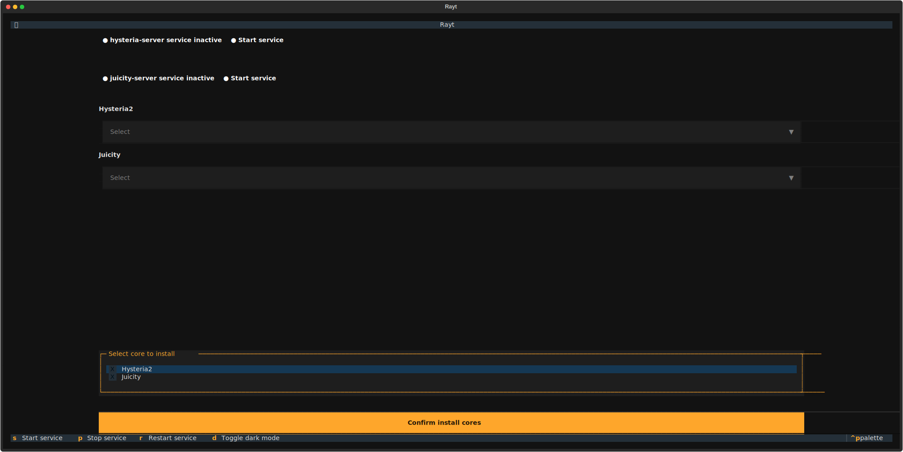
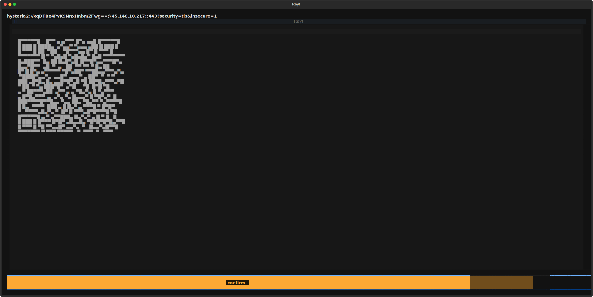

# rayt

A TUI program for setting up hysteria2 and juicity proxy services.

## Dependencies

- bash
- openssl
- curl

## Installation

1. Install with uv package manager:
   ```sh
   uv tool update-shell
   export PATH="/home/user/.local/bin:$PATH"
   uv tool install rayt
   ```

2. Run rayt with:
   ```sh
   sudo rayt
   ```

Follow the on-screen instructions to set up hysteria2 and juicity proxy services.

## Images




## Notes

- Remember to open port 443 on your firewall.
- When starting the hysteria-server service, make sure to stop the juicity-server service.
